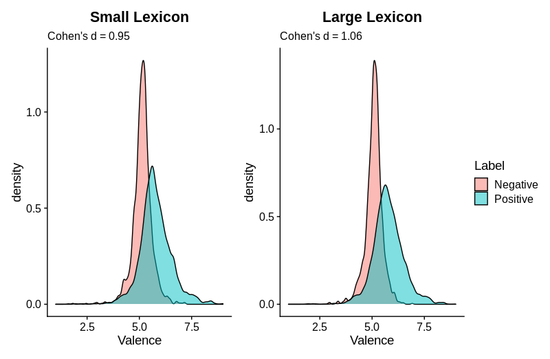

# hebnoRms: Affect Norms for Hebrew 

`hebnoRms` provides affect norms (valence and arousal; ranging from 1 to 9) for up to 1.4M hebrew words.
It was built on E-Millim (Armony-Sivan et al., 2013) and expanded using fasttext (Joulin et al., 2016) and the SVLM Hebrew Wikipedia Corpus (Silber-Varod et al., 2017).

Hebrew is a morphologically rich language, an as such it makes relativly simple NLP tasks more challenging than in English. 

`hebnoRms` takes a heuristic approach, instead of parsing every single word, it overcomes with large lexica (22K and 1.4M) 
that includes separate values for each token, even if the target word is the same [*samaxti* (I was *happy*) $\neq$  *esmax* (I will be *happy*)].

Please note that using the large lexicon is significantly  slower than the smaller one.

Download and Install
--------------------

You can install hebnoRms with:

    # install.packages("remotes")
    remotes::install_github("almogsi/hebnoRms")

Examples
--------

    library(hebnoRms)

    get_valence("בדד אלך גם תפילה אין לי")

    ##   [1] 5.27  
     

    get_valence("בדד אלך גם תפילה אין לי", long = TRUE) #use large lexicon (1.4M tokens)

    ##   [1] 5.13       	
    

    get_valence("יום הולדת חגיגה נחמדת")

    ##   [1] 7.02  
     

    get_valence("יום הולדת חגיגה נחמדת", long = TRUE) #use large lexicon (1.4M tokens)

    ##   [1] 7.01 
	
	
Validation
----------

It was validated on the *Neural Sentiment Analyzer for Modern Hebrew* (Amram, Ben-David, & Tsarfaty, 2018), resulting in *Cohen's d* = 0.95 and 
*Cohen's d* = 1.06 for the small and large lexica respectively.

    
References
----------

Joulin, A., Grave, E., Bojanowski, P., Douze, M., Jégou, H., & Mikolov, T. (2016). Fasttext. zip: Compressing text classification models. arXiv preprint arXiv:1612.03651.

Silber-Varod, V., Latin, M., & Moyal, A. (2017) "Frequency of Hebrew phonemes and phoneme clusters in a data-driven approach. (in Hebrew). Literacy and Language (Oryanut Ve-Safa), 6, 22-36

Armony-Sivan, R., Cojocaru, L., Babkoff, H. (2013). Affective norms for Hebrew words
(E-millim): Instruction manual and affecting ratings. Ashkelon Academic College,
Ashkelon, Israel.

